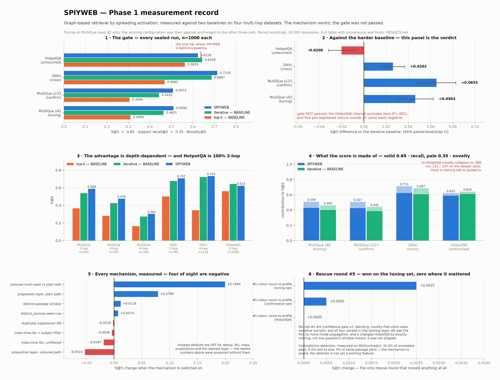

# Phase 1 — the complete measurement record

One table, every number Phase 1 produced. It replaces a folder of separate
charts, because a reader comparing nine images cannot see which of them
disagree.

**Verdict up front: the Phase 1 gate was NOT passed.** Spreading activation
beats plain `top-k` on all four datasets and beats the iterative baseline on
three, but loses to it on HotpotQA by −.0200 (P=.001), and five pre-registered
attempts to close that gap all came back negative. The advantage is real and
**depth-dependent**. Row A8 is the row that decides it.

### How to read this

- **Metric.** S@k = `0.65 · support recall@k + 0.35 · Novelty@k`. Novelty@k
  counts relevant nodes that plain `top-k` never returns, so it is **0 by
  construction** for the `top-k` baseline — a row where SPIYWEB's novelty
  advantage is large is not evidence of anything on its own; the composite is.
- **Protocol.** Tuning happened only on MuSiQue seed 42. The winning
  configuration was then applied **unchanged** to seed 123 (confirmation),
  2WikiMultihopQA (cross-dataset) and HotpotQA (never tuned on). Intervals are
  paired bootstrap, 10,000 resamples, 95%.
- **Provenance.** Groups A–D and H were recomputed for this table from each
  run's `per_query.jsonl` and index artifacts. Confidence intervals and the
  ablation deltas in E–G are quoted from the Phase 1 closing report and the
  decision log, which recomputed them the same way; they were not
  recomputed again here.
- **Config the sealed runs used.** Coloured multi-seed, sequential chaining,
  seed width 2 per colour, max 4 colours, threshold ratio .01, split alpha 3.0.
  Duplicate suppression, node mass, index-time NLI, the proposition layer, the
  learned layer and the distinct-passage window were all **off** — see H5.



*Regenerate with `uv run --with matplotlib python Stats/make_figure.py`. The script carries the same sealed values as the table below.*

---

## The table

| # | Group | Measurement | SPIYWEB | Comparator | Δ (95% CI) | Reading |
|---|---|---|---|---|---|---|
| **A1** | Gate · S@5 | MuSiQue seed 42 (tuning), n=1000 | **.5094** | top-k .3090 — BASELINE | +.2004 [+.1837, +.2171] | pass |
| **A2** | Gate · S@5 | MuSiQue seed 42 (tuning), n=1000 | **.5094** | iterative .4631 — BASELINE | +.0463 [+.0299, +.0624] | pass |
| **A3** | Gate · S@5 | MuSiQue seed 123 (confirmation), n=1000 | **.5073** | top-k .3046 — BASELINE | +.2027 [+.1857, +.2194] | pass |
| **A4** | Gate · S@5 | MuSiQue seed 123 (confirmation), n=1000 | **.5073** | iterative .4420 — BASELINE | +.0653 [+.0478, +.0826] | pass |
| **A5** | Gate · S@5 | 2Wiki (cross-dataset), n=1000 | **.7130** | top-k .4682 — BASELINE | +.2448 [+.2301, +.2598] | pass |
| **A6** | Gate · S@5 | 2Wiki (cross-dataset), n=1000 | **.7130** | iterative .6867 — BASELINE | +.0262 [+.0164, +.0367] | pass |
| **A7** | Gate · S@5 | HotpotQA (never tuned on), n=1000 | **.6228** | top-k .5623 — BASELINE | +.0605 [+.0464, +.0750] | pass |
| **A8** | Gate · S@5 | HotpotQA (never tuned on), n=1000 | .6228 | iterative **.6428** — BASELINE | **−.0200 [−.0317, −.0086] P=.001** | **FAIL — this row is the gate** |
| B1 | Decomposition @5 | MuSiQue s42 · support recall | .6641 | top-k .4754 · iterative .6218 | +.1887 / +.0423 | — |
| B2 | Decomposition @5 | MuSiQue s42 · Novelty@5 | .2222 | top-k .0000 · iterative .1683 | +.2222 / +.0539 | top-k novelty is 0 by definition |
| B3 | Decomposition @5 | MuSiQue s42 · bridge recall | .7803 | top-k .6413 · iterative .7090 | +.1390 / +.0713 | the intermediate document ranks higher |
| B4 | Decomposition @5 | MuSiQue s123 · support recall | .6590 | top-k .4686 · iterative .5979 | +.1904 / +.0611 | — |
| B5 | Decomposition @5 | MuSiQue s123 · Novelty@5 | .2255 | top-k .0000 · iterative .1524 | +.2255 / +.0731 | — |
| B6 | Decomposition @5 | MuSiQue s123 · bridge recall | .7598 | top-k .6250 · iterative .6753 | +.1348 / +.0845 | — |
| B7 | Decomposition @5 | 2Wiki · support recall | .9640 | top-k .7202 · iterative .9377 | +.2438 / +.0263 | near ceiling |
| B8 | Decomposition @5 | 2Wiki · Novelty@5 | .2467 | top-k .0000 · iterative .2205 | +.2467 / +.0262 | — |
| B9 | Decomposition @5 | 2Wiki · bridge recall | .9785 | top-k .8898 · iterative .9738 | +.0887 / +.0047 | ceiling; nothing left to win |
| B10 | Decomposition @5 | HotpotQA · support recall | .9105 | top-k .8650 · iterative **.9440** | +.0455 / **−.0335** | **where the loss is born** |
| B11 | Decomposition @5 | HotpotQA · Novelty@5 | .0885 | top-k .0000 · iterative .0835 | +.0885 / +.0050 | vs .222 / .247 on the deeper sets |
| B12 | Decomposition @5 | HotpotQA · bridge recall | .9435 | top-k .9260 · iterative **.9590** | +.0175 / **−.0155** | — |
| C1 | Depth · S@5 | MuSiQue s42, 2-hop (n=537) | .589 | top-k .367 · iterative .539 | +.222 / +.050 | — |
| C2 | Depth · S@5 | MuSiQue s42, 3-hop (n=307) | .476 | top-k .281 · iterative .426 | +.195 / +.050 | — |
| C3 | Depth · S@5 | MuSiQue s42, 4-hop (n=156) | .303 | top-k .164 · iterative .274 | +.139 / +.029 | — |
| C4 | Depth · S@5 | MuSiQue s123, 2-hop (n=486) | .576 | top-k .376 · iterative .526 | +.200 / +.050 | — |
| C5 | Depth · S@5 | MuSiQue s123, 3-hop (n=343) | .477 | top-k .275 · iterative .417 | +.202 / +.060 | — |
| C6 | Depth · S@5 | MuSiQue s123, 4-hop (n=171) | .374 | top-k .159 · iterative .253 | +.215 / **+.121** | the widest margin anywhere |
| C7 | Depth · S@5 | 2Wiki, 2-hop (n=784) | .707 | top-k .502 · iterative .677 | +.205 / +.030 | — |
| C8 | Depth · S@5 | 2Wiki, 4-hop (n=216) | .733 | top-k .344 · iterative .723 | +.389 / +.010 | — |
| C9 | Depth · S@5 | HotpotQA, 2-hop (n=1000) | .623 | top-k .562 · iterative .643 | +.061 / **−.020** | the set is 100% 2-hop |
| D1 | Cutoff | MuSiQue s42 · S@2 / S@10 | .3690 / .5518 | iterative .3612 / .5127 | +.008 / +.039 | advantage widens with k |
| D2 | Cutoff | MuSiQue s123 · S@2 / S@10 | .3497 / .5402 | iterative .3327 / .4994 | +.017 / +.041 | — |
| D3 | Cutoff | 2Wiki · S@2 / S@10 | .5786 / .7171 | iterative .5587 / .6970 | +.020 / +.020 | — |
| D4 | Cutoff | HotpotQA · S@2 / S@10 | .5233 / .6329 | iterative .5826 / .6448 | **−.059** / −.012 | loss is worst at small k |
| E1 | Gate rescue #1 | confidence gate on contact strength | — | pre-registered control | negative | AUC ~.60; not visible at query time |
| E2 | Gate rescue #2 | confidence gate on overlap-5 band | — | pre-registered control | negative | AUC .70–.75, but fired slice is only 31% precise |
| E3 | Gate rescue #3 | blend web with dense ranking | — | pre-registered control | negative | wins only on HotpotQA — a patch, which the gate refuses |
| E4 | Gate rescue #4 | novelty-free slots | — | pre-registered control | negative | premise false: novelty-free slots do carry recall |
| E5 | Gate rescue #5 | colour count → query profile | .5119 (tuning) | P0 .5094 | +.0025 [+.0005, +.0050] P=.010 | **not shipped**: unconfirmed on seed 123 (+.0005, P=.743), and **exactly ±.0000 [0,0] on HotpotQA** |
| F1 | Ablation | coloured multi-seed vs plain web | — | plain web | **+.1994** | the single largest shipped gain |
| F2 | Ablation | duplicate suppression ON (D6) | — | OFF (sealed default) | −.0019 P=.228 | flat; mechanism proven separately on paraphrase corpora |
| F3 | Ablation | `distinct_sources` seed rule | — | OFF | +.0074 P=.488 | fixed seed-twin collapse 261/534 → 0/534; S@5 flat |
| F4 | Ablation | node mass (D11) | — | OFF | no gain in either layer arrangement | open question #7 closed; default OFF |
| F5 | Ablation | index-time NLI, no subject filter | — | OFF | −.0187 | harmful |
| F6 | Ablation | index-time NLI + shared-subject filter | — | OFF | −.0038 P=.017 | ~5× less harmful, still negative; default OFF |
| F7 | Ablation | proposition layer, plain path | — | chunks only | **+.0790** | helps |
| F8 | Ablation | proposition layer, coloured path | — | chunks only | **−.0524** | hurts — 54% of colours seed two propositions of one passage |
| F9 | Ablation | distinct-passage ranking window | — | node window | +.0118 [+.0032, +.0224] | explains 23% of F8; default OFF to keep comparability |
| F10 | Ablation | learned layer, read weight .3 / 1.0 / 3.0 | — | layer off | 0 of 50 questions changed | at weight 10.0 (33× shipped): 1 of 50 |
| F11 | Ablation | learned layer, forgetting 1.00/.99/.95/.90 | — | layer off | identical, CI [0, 0] | edges do strengthen (max .106); the top-5 never moves |
| G1 | Detection | contradiction recall, WikiContradict (253 annotated real pairs) | 31.6% | human annotation | — | at the shipped threshold |
| G2 | Detection | contradiction recall, same-passage pairs (63 of the 253) | **0%** | human annotation | — | structural: edges run *between* nodes |
| G3 | Detection | contradiction recall, end to end after subject filter | **9.5%** | human annotation | — | filter cuts candidates 5,418 → 405 |
| G4 | Detection | negated-fact tagging via the extraction call (#11) | 4 labels / 29,566 propositions | loose prompt: 142 labels | miss rate 160× vs 4.4× | loose prompt **fabricated** denials; closed NEGATIVE, `tag_polarity=False` |
| H1 | Index shape | nodes · semantic · entity · **structural** edges | MuSiQue s42: 11,835 · 43,405 · 632,838 · **0** | — | — | — |
| H2 | Index shape | same, MuSiQue s123 / 2Wiki / HotpotQA | 11,450·42,165·604,787·**0** / 6,434·22,993·134,771·**0** / 9,795·34,859·450,731·**0** | — | — | **the structural layer is empty in all four** |
| H3 | Termination | runs stopped by the energy threshold | 4000 of 4000 | `max_nodes` / `max_hop` caps | 0 | the caps never fired; the web really does die on its own |
| H4 | Cost | LLM calls per question, query time | 2.31 – 2.69 | iterative ≈ 4 — BASELINE | ~1.5× cheaper | index-time proposition extraction is separate: ~10.6 h/corpus, ≈150× indexing |
| H5 | Reproducibility | seed-123 control cell re-run | .5023 | sealed .5073 | −.0050 | **declared deviation**: that set's LLM cache was incomplete, ~588 fresh decompositions were generated. The other three reproduced exactly |

---

## What this table does not say

Seven limits, stated because a results page that only lists wins is not a
results page.

1. **Generalisation is dataset-dependent.** Three wins, one loss, and the loss
   is on the set that never saw tuning. That is a condition, not a footnote.
2. **The structural edge layer was never actually tested** (H1, H2). In
   MuSiQue, HotpotQA and 2Wiki every passage is its own single-unit document,
   so there is no adjacency and no shared section. The "layered hybrid" was in
   practice **semantic + entity**. Testing it needs a corpus with real document
   structure.
3. **Contradiction detection is not a working feature yet** (G1–G3). The
   mechanism is sound; roughly 90% of real contradiction pairs are missed, and
   every same-passage pair is invisible by construction. Deferred to Phase 2.
4. **Duplicate suppression was OFF in every sealed run** (F2). Its benefit was
   demonstrated on paraphrase corpora, not inside these numbers.
5. **Repetition is not truth.** Vote counts measure corpus support. Counting
   per document limits the failure mode; it does not remove it.
6. **Query-time latency was never measured.** Deliberately out of scope until
   the gate is passed.
7. **−.0524 on the coloured proposition path is only 23% explained** (F8, F9).
   The rest is open.

## Reproducing this

Nothing here was re-run to produce this page. The sealed artifacts are
`data/{musique_t13, musique_seed123, 2wiki_t13, hotpotqa}/` — `results.json`
for the aggregates, `per_query.jsonl` for the per-question records the
intervals are computed from. They are not in the repository: they are hundreds
of megabytes of benchmark corpora and vectors. To regenerate them:

```bash
pip install -e ".[index]"
python -m spiyweb.evaluation.run all --dataset musique --sample-size 1000 --sample-seed 42
```

Reproducibility in this project rests on the LLM cache, not on a random seed —
H5 is what happens when the cache is missing.

---

See [`README.md`](README.md) for what the project is and
[`CHANGELOG.md`](CHANGELOG.md) for what has changed since.
